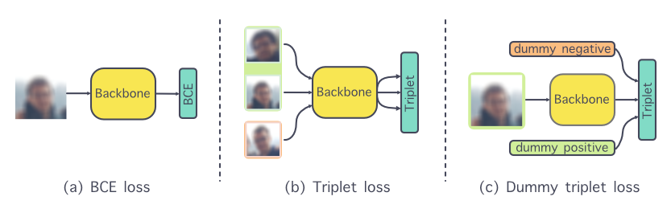

# DmyT: Dummy Triplet Loss for Deepfake Detection



This is a Pytorch implementation of "DmyT: Dummy Triplet Loss for Deepfake Detection"

### Prepare your dataset

Your need to organise your data as follow:

```
dataset
├── train
│   ├── class 1
|   |   ╰ ...
│   ├── class 2
|   |   ╰ ...
│   ╰── ...
|
├── test
│   ├── class 1
|   |   ╰ ...
│   ├── class 2
|   |   ╰ ...
│   ╰── ...
|
╰── valid
│   ├── class 1
|   |   ╰ ...
│   ├── class 2
|   |   ╰ ...
│   ╰── ...
```

### Training

Training can be performed using the script `src/train.py`. You can use this bash script and complete the parameters:

```bash
# Learning rate (ex: 2e-5)
LR = 
# Number of epochs
EPOCH = 
# Model name from TIMM library
MODEL=
# Batch Size
BATCH= 
# Trained model location
OUTPUT=
# Loss name (either BCE - DmyT - Triplet)
LOSS=
# Path to the dataset
DATASET=
# Label-weights (for imbalanced datasets)
L_WEIGHTS=

python src/train.py --lr             $LR     \\
                    --epoch          $EPOCH  \\
                    --model          $MODEL  \\
                    --batch          $BATCH  \\
                    --output         $OUTPUT \\
                    --loss           $LOSS   \\
                    --dataset        $DATASET \\
                    --label-weights  $L_WEIGHTS
```

The model automatically detects how many classes are present in the dataset. Note that we specifically prepared the dummy for our case (in *src/loss/dummy_config.py*) and you may have to redifine them for your training.

### Testing

Testing can be performed using the script `src/test.py`. You can use this bash script and complete the parameters:

```bash
# Model name from TIMM library
MODEL=
# Location of the saved weights
WEIGHTS=
# Loss name (either BCE - DmyT - Triplet) If you want to use transfert learning, use Triplet (even if the model was trained with DmyT).
LOSS=
# Path to the dataset
DATASET=

python src/test.py  --model   $MODEl   \\
                    --weights $WEIGHTS \\
                    --loss    $LOSS    \\
                    --dataset $DATASET \\
```

### Cite

``` bibtex
@inproceedings{10.1145/3476099.3484316,
author = {Beuve, Nicolas and Hamidouche, Wassim and Deforges, Olivier},
title = {DmyT: Dummy Triplet Loss for Deepfake Detection},
year = {2021},
isbn = {9781450386821},
publisher = {Association for Computing Machinery},
address = {New York, NY, USA},
url = {https://doi.org/10.1145/3476099.3484316},
doi = {10.1145/3476099.3484316},
booktitle = {Proceedings of the 1st Workshop on Synthetic Multimedia - Audiovisual Deepfake Generation and Detection},
pages = {17–24},
numpages = {8},
keywords = {neural networks, metric learning, deepfake forensics},
location = {Virtual Event, China},
series = {ADGD '21}
}
```